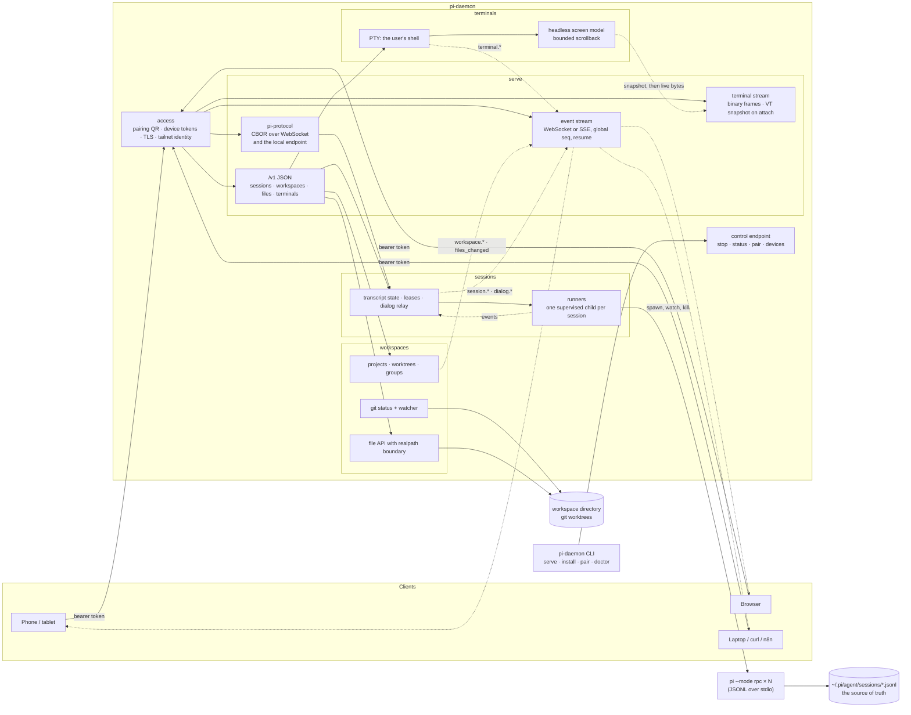

# pi-daemon

A cross-platform daemon that runs [Pi Coding Agent](https://pi.dev) sessions on your machine and
serves them to any client over an authenticated network API.

Sessions live in the daemon, not in a terminal. They keep running while every client is gone,
stream what they do as events, and turn the moments where the agent blocks on a human into
messages any client can answer. A phone on the couch, a laptop across the house, and a browser
tab can all be attached to the same session at once.



Solid arrows are requests; dotted arrows are what flows back. Sessions and terminals are separate
paths: a session is a `pi --mode rpc` process whose structured events become a transcript, a
terminal is a plain shell in a PTY whose bytes the daemon keeps on a screen model so a client
can leave and come back.

**Each session is a supervised `pi` process.** Not an SDK object inside the daemon — a child
process the daemon starts, watches, and can kill. One wedged session degrades one session instead
of taking down every session on the machine, eviction reclaims memory with certainty, and the
daemon imports no pi SDK at all: it needs the `pi` binary, plus one prebuilt native addon for
terminals. The session's JSONL file stays the source of truth, so a session started from a phone
resumes with `pi --session <id>` in a terminal, and vice versa.

**Client neutral by construction.** The session surface is
[`@earendil-works/pi-protocol`](https://pi.dev) — pi's own remote-session protocol, for which pi
publishes schemas and a client but no server. This daemon is the missing server, so pi's
`PiClient` and `RemoteSession` drive it unmodified. Everything that protocol does not model is a
plain JSON `/v1` API carrying the same state, so a client written in Swift, Kotlin, Python, or
`curl` needs neither CBOR nor a pi dependency. Our own clients live in separate repositories and
get no back door.

**The daemon decides less than you might expect.** Approvals and project trust belong to pi and
the operator's own pi configuration; the daemon relays the question to a client and the answer
back, and keeps no policy of its own. It also never touches a provider credential — the runner
uses the pi authentication already on the machine.

**Access.** Every request is authenticated; network position alone grants nothing. A client pairs
once by scanning a QR code carrying a short-lived single-use code and the daemon's certificate
fingerprint, then exchanges it for its own revocable device token. A tailnet is the expected way
in, but it is defence in depth — never a substitute for the token.

## Installation

The daemon is one Node program with one prebuilt native addon (the PTY for terminals). No
compiler is needed on any of the three platforms.

### Prerequisites, everywhere

| What | Why | How |
| --- | --- | --- |
| Node.js 22.19 or newer (24 works) | runs the daemon | see the platform sections below |
| `pi` on `PATH`, signed in to a provider | every session is a `pi --mode rpc` child | `npm i -g @earendil-works/pi-coding-agent`, then run `pi` once and sign in |
| `git` | worktrees, status, diffs (optional: without it, `worktrees` is absent from capabilities) | platform package manager |
| Tailscale (optional) | the intended way in from other devices, and a publicly trusted certificate | [tailscale.com/download](https://tailscale.com/download), with MagicDNS and HTTPS certificates enabled for your tailnet |

Supported pi versions are `>=0.84.0 <0.86.0`; `pi-daemon doctor` checks the installed one.

### Get pi-daemon

Until the package is on npm, install from a clone:

```sh
git clone https://github.com/CoresoftHQ/pi-daemon.git
cd pi-daemon
npm install
npm run build
npm link -w packages/daemon      # puts `pi-daemon` on your PATH, pointing at this clone
pi-daemon doctor
```

Once published, this becomes `npm i -g pi-daemon`. Either way, `pi-daemon doctor` is the first
thing to run: it names anything missing and how to fix it.

### Linux

```sh
# Node: any of these
sudo apt install nodejs npm            # Debian/Ubuntu 24.04+ ship Node 22 or newer; check `node --version`
# or: curl -fsSL https://deb.nodesource.com/setup_22.x | sudo -E bash - && sudo apt install nodejs
# or: nvm install 22

sudo apt install git                   # or your distribution's equivalent
pi-daemon install                      # systemd user unit, started now and at every login
```

`install` also runs `loginctl enable-linger` so the daemon keeps running after you log out of a
headless box; some distributions ask for authentication at that step, and if it is refused the
unit still starts at every login. The PTY addon has prebuilds for x64 and arm64, glibc and musl,
so Alpine works too. Files live under `~/.local/share/pi-daemon`, `~/.config/pi-daemon`, and
`~/.local/state/pi-daemon`.

### macOS

```sh
brew install node git                  # Node 24 from Homebrew is fine
pi-daemon install                      # a LaunchAgent with RunAtLoad and KeepAlive
```

For `bind: tailscale` the daemon runs the `tailscale` command. The Mac App Store build keeps it
inside the app bundle, so put it on your `PATH` once:

```sh
sudo ln -s /Applications/Tailscale.app/Contents/MacOS/Tailscale /usr/local/bin/tailscale
```

Files live under `~/Library/Application Support/pi-daemon`, logs under
`~/Library/Logs/pi-daemon`.

### Windows

```powershell
winget install OpenJS.NodeJS.LTS       # Node 22 LTS; or the installer from nodejs.org
winget install Git.Git
winget install Microsoft.PowerShell    # optional: terminals use pwsh when present, Windows PowerShell otherwise
pi-daemon install                      # a scheduled task at your logon; no admin needed
```

Windows 10 1809 or newer is needed for ConPTY, which terminals use. The first time the daemon
binds a non-loopback address Windows shows a firewall prompt; allow it for private networks. A
boot-time Windows Service (running before anyone logs on) is not provided in 1.0; the logon task
is the supported form. Files live under `%LOCALAPPDATA%\pi-daemon`.

### First run, on any of them

```sh
pi-daemon status                       # running? where? which pi?
pi-daemon pair                         # QR code and text for the first device; it becomes the owner
pi-daemon config set bind tailscale    # reachable from your other devices, with a real certificate
pi-daemon stop && pi-daemon start
pi-daemon logs -f
```

`pi-daemon serve --foreground` runs it in the current terminal instead of as a service, which is
the right way to try it out. `pi-daemon uninstall` removes the service and nothing else; the
data directory stays until you delete it. `PI_DAEMON_HOME=<dir>` moves everything under one
directory, for a second daemon or a throwaway.

The daemon listens on loopback with no TLS until `bind` is `tailscale` (a publicly trusted
certificate for the MagicDNS name) or an explicit address (self-signed, fingerprint in the QR).
Read [docs/operating.md](docs/operating.md) before doing either: a device token is shell access as
the user the daemon runs as.

## Status

All ten milestones of the [plan](docs/plan.md) are implemented on the `develop` branch, with CI
across Linux, macOS, and Windows on Node 22 and 24, and against pi at both ends of the supported
range. `1.0.0` is prepared there ([CHANGELOG](CHANGELOG.md)) and waits on the human reviews and
the 24-hour soak before it is tagged. Read [docs/operating.md](docs/operating.md) before exposing
a daemon to a network.

- [Overview](docs/overview.md) — one page: how the daemon works and how clients integrate.
- [Specification](docs/spec.md) — requirements, the runner architecture, both wire surfaces,
  the file API, terminals, access, safety, lifecycle, and the three operating systems.
- [Implementation plan](docs/plan.md) — ten milestones, acceptance criteria, and risks.
